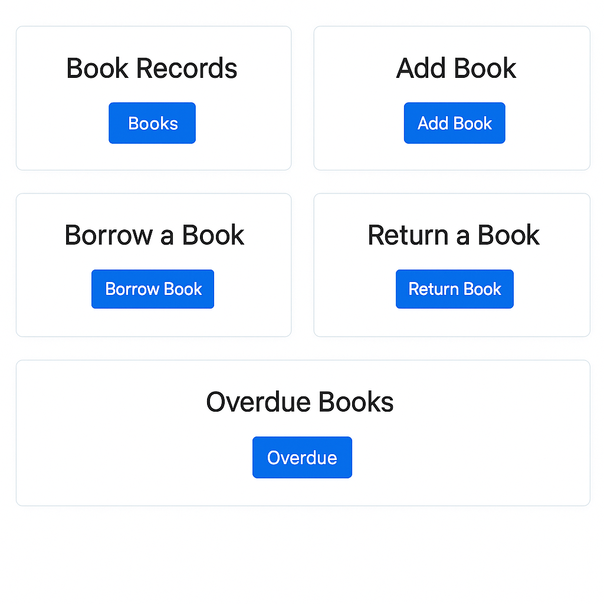
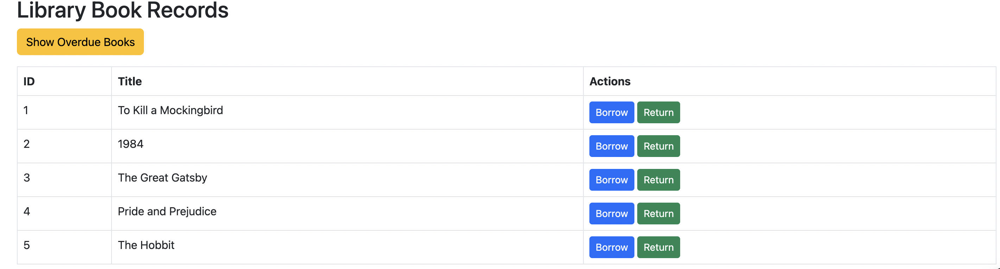
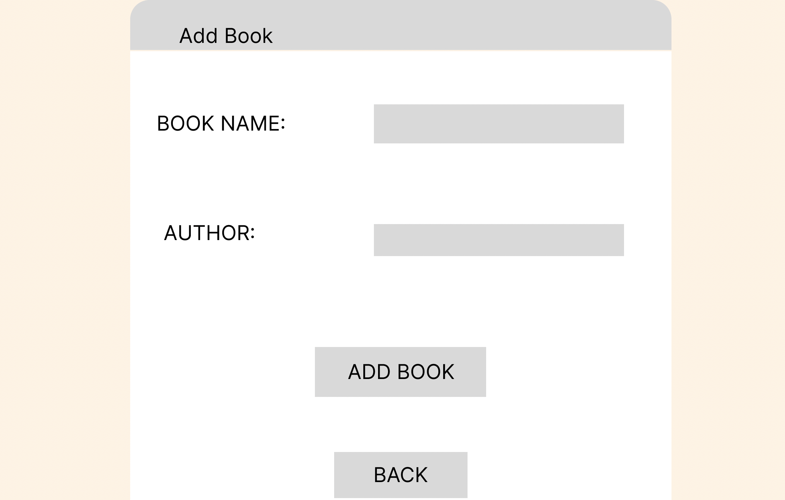
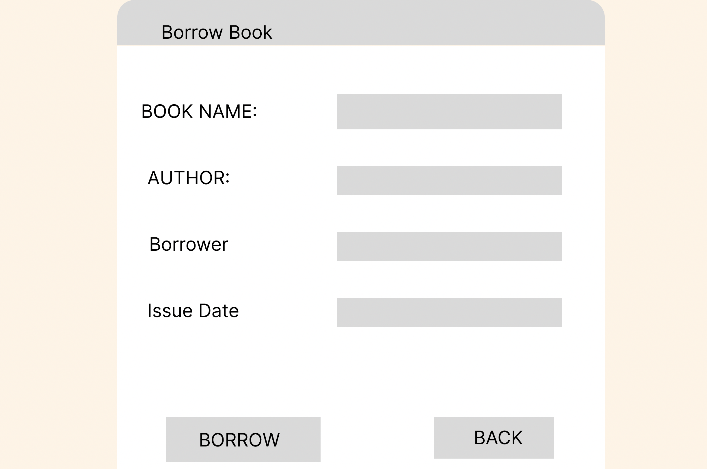
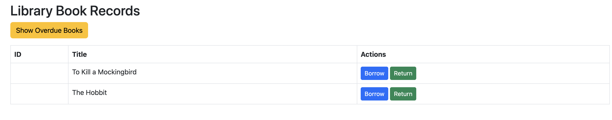

# 📚 Library Management System

This project is a simple Flask-based **Library Management System** backed by a MySQL database. It provides an interface to manage books, authors, borrowers, and loan operations through a web-based frontend.

---

## ✅ Features

1. **CRUD for Books, Authors, and Borrowers**
2. **Borrow a Book** (with issue validation)
3. **Return a Book** (return date recorded)
4. **Track Overdue Books**
5. **Many-to-Many Relationship**: Books ↔ Authors
6. **Unique Constraints**: A book can't be borrowed more than once until returned
7. **Overdue Query Logic**

---

## 📸 Screenshots

### Dashboard


### Book Records


### Add Book


### Borrow a Book


### Return a Book


### Overdue Books


---

## 🗃️ Database Schema

### Tables:
- `authors` (id, name)
- `books` (id, title, author_id)
- `borrowers` (id, name)
- `loans` (id, book_id, borrower_id, borrow_date, return_date)

### Relationships:
- A **book** belongs to one **author**
- A **loan** references both a **book** and a **borrower**

---

## 🔌 How to Run

1. Clone the repository:
   ```bash
   git clone https://github.com/your-username/library-management-system.git
   cd library-management-system
   ```

2. Install dependencies:
   ```bash
   pip install flask mysql-connector-python
   ```

3. Update `config.py` with your MySQL credentials.

4. Import the `sample_data.sql` file into your MySQL database.

5. Run the server:
   ```bash
   python app.py
   ```

6. Open the browser at [http://127.0.0.1:5000](http://127.0.0.1:5000)

---

## 📂 Project Structure

```
library-management-system/
├── app.py
├── config.py
├── static/
│   └── styles.css
├── templates/
│   ├── index.html
│   ├── books.html
│   ├── authors.html
│   ├── borrowers.html
│   ├── loans.html
├── sample_data.sql
└── README.md
```

---

## 📅 Sample Data

- 5 sample **books**
- 5 **authors**
- 5 **borrowers**
- 3 **active loans**
- 1 **overdue loan** for testing overdue tracking

---

## 📌 Logic Highlights

- Prevents double borrowing of the same book.
- Checks for overdue books based on return date.
- Each section of the app supports full CRUD operations.

---

## 🙌 Contribution

Pull requests and suggestions are welcome!

---

🧠 Advanced Concepts
Many-to-Many Relation: book_author table handles books with multiple authors.

Unique Constraint Logic: Prevents borrowing the same book if it's already issued.

Overdue Query Logic:

sql

SELECT b.title, l.issue_date 
FROM loans l
JOIN books b ON l.book_id = b.id
WHERE l.return_date IS NULL
AND l.issue_date < NOW() - INTERVAL 7 DAY;


✍️ Author
Bijesh Thomas
📫 [LinkedIn (optional)](https://www.linkedin.com/in/bijesh-thomas/)

## 📜 License

MIT License © Bijesh Thomas
